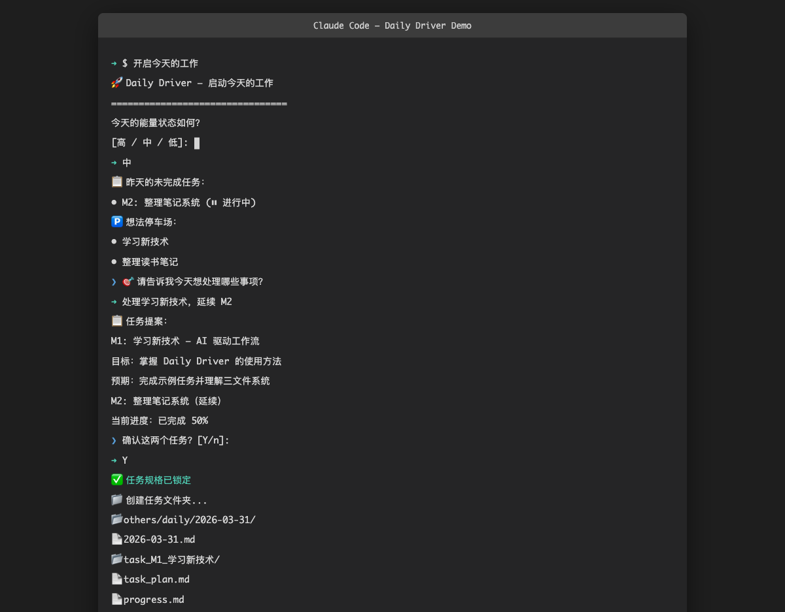
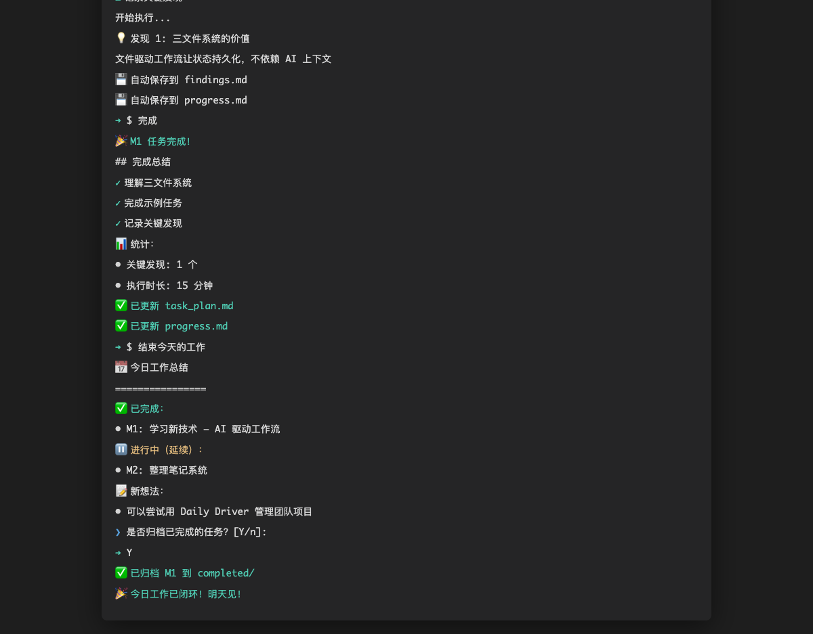
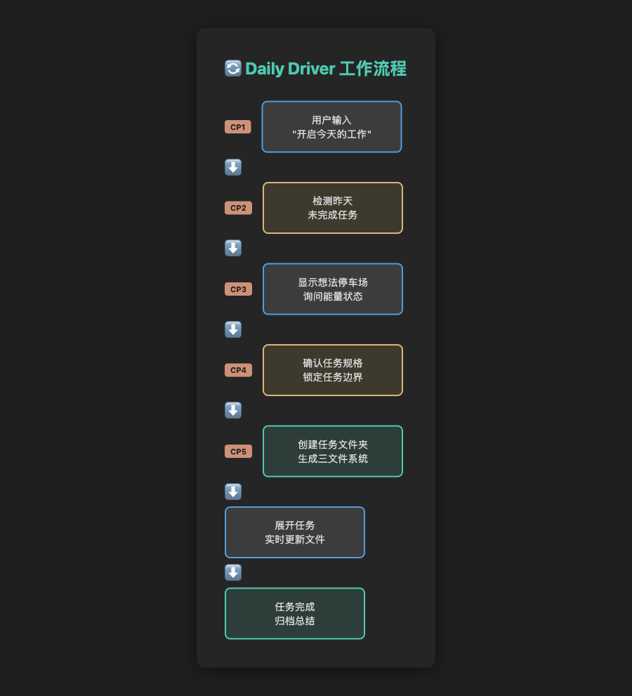
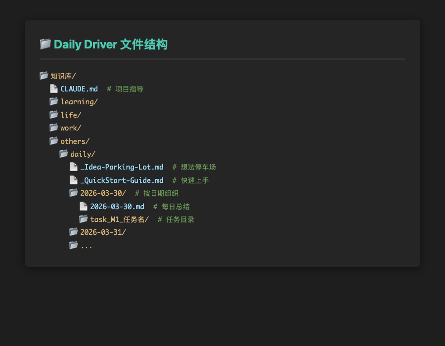
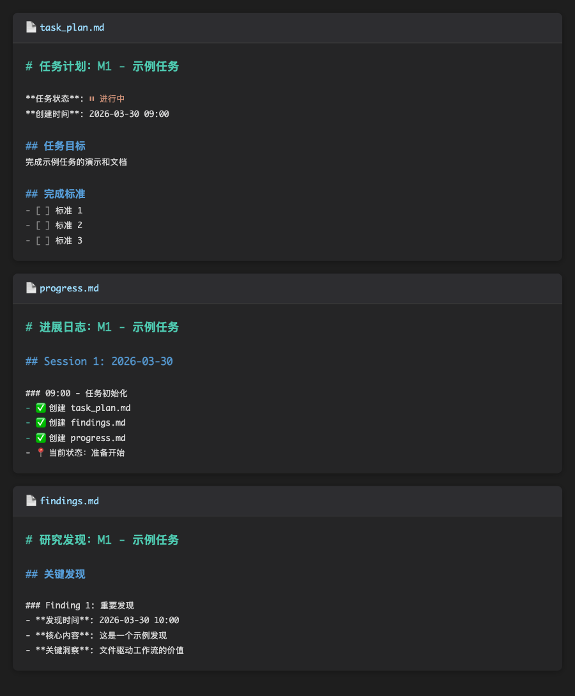

# Daily Driver Workspace

> 🚀 AI 驱动的个人工作流管理系统 —— 让文件成为你的外部记忆

[](https://opensource.org/licenses/MIT)

---

## 📸 演示

### 完整工作流程

#### Step 1: 启动今天的工作

*检测昨天任务 → 显示想法停车场 → 确认今日任务 → 创建文件夹*

#### Step 2: 展开并执行任务

*读取 task_plan.md → 实时记录发现 → 自动保存到文件*

#### Step 3: 任务完成与总结

*标记完成 → 生成总结 → 归档任务 → 结束一天*

### 工作流程图

*上图：Daily Driver 的 5 层检查点工作流程*

### 文件结构

*上图：知识库文件夹结构*

### 三文件系统

*上图：每个任务包含 task_plan.md、progress.md、findings.md 三个文件*

---

## ✨ 核心特性

### 🗂️ 文件驱动
所有任务状态保存在文件系统，不依赖 AI 的 Context Window。随时中断，随时恢复。

### 🔒 强制闭环
每个任务必须有**计划 → 执行 → 发现 → 完成**的完整记录，拒绝悬空对话。

### 🤖 Agent 自助安装
Agent 读取 `AGENT_SETUP.md` 后自动完成全部部署，无需手动配置。

### 📊 5层检查点体系
从需求澄清到边界检查，确保 AI 不会跑偏。

---

## 🚀 快速开始

### 方式一：Agent 自动安装（推荐）

```bash
# 1. 克隆仓库
git clone https://github.com/colin66611/daily-driver-workspace.git
cd daily-driver-workspace

# 2. 告诉 Agent："读取 AGENT_SETUP.md 并完成安装"
# Agent 会自动完成后续所有步骤
```

### 方式二：手动安装

```bash
# 1. 克隆仓库
git clone https://github.com/colin66611/daily-driver-workspace.git
cd daily-driver-workspace

# 2. 运行安装脚本
./install.sh

# 3. 输入知识库根目录路径（默认当前目录）
```

### 方式三：复制技能

```bash
# 1. 复制技能到 Claude Code
cp -r .claude/skills/* ~/.claude/skills/

# 2. 创建你的工作区
mkdir -p ~/my-notes/{learning,life,work,others/daily}
```

---

## 🎯 使用方法

### 启动一天的工作

```
你：开启今天的工作

Agent：今天的能量状态如何？[高 / 中 / 低]

你：中

Agent：🅿️ 想法停车场内容：
       - [想法1]
       - [想法2]

       请告诉我今天想处理哪些事项？

你：处理想法1和M3任务

Agent：[生成任务提案并逐条确认]
       [确认规格]
       [创建任务文件夹和文件]

       ✅ 今日工作已锁定。准备开始工作。
       需要我展开哪个任务？
```

### 展开具体任务

```
你：展开 M1

Agent：[读取 task_plan.md]
       🔒 规格已锁定
       [开始执行任务]
       [每2个操作保存发现到 findings.md]
       [更新 progress.md]
```

### 结束一天的工作

```
你：结束今天的工作

Agent：[总结完成的任务 🎉]
       [记录未完成项]
       [询问是否归档]
```

---

## 📁 文件结构

```
你的知识库/
├── CLAUDE.md                 # 项目指导和长期记忆
├── learning/                 # 学习相关
├── life/                     # 生活相关
├── work/                     # 工作相关
└── others/
    ├── daily/                # 每日工作区
    │   ├── _Idea-Parking-Lot.md
    │   └── 2026-03-30/       # 按日期组织
    │       ├── 2026-03-30.md
    │       └── task_M1_任务名/
    │           ├── task_plan.md
    │           ├── progress.md
    │           └── findings.md
    └── demo/
```

---

## 🏗️ 系统架构

```
用户输入
  ↓
【检查点1】检测昨天未完成任务
  ↓
【检查点2】读取想法停车场
  ↓
【检查点3】确认今日任务
  ↓
【检查点4】锁定任务规格
  ↓
创建任务文件夹和文件
  ↓
【检查点5】执行时边界检查
  ↓
任务完成 → 归档
```

---

## 📚 文档

- [AGENT_SETUP.md](AGENT_SETUP.md) - 给 AI 看的安装指南
- [示例工作区](examples/) - 完整的工作区示例
- [设计文档](docs/design.md) - 系统设计详情

---

## 🖼️ 截图展示

### 任务文件夹结构


*知识库的文件夹结构，按日期组织任务*

### 三文件系统


*每个任务包含 task_plan.md、progress.md、findings.md 三个文件*

---

## 🔧 系统要求

- [Claude Code](https://claude.ai/code) 或 [OpenCode](https://github.com/your-username/opencode)
- Unix-like 系统（macOS / Linux）
- Git

---

## 🤝 贡献

欢迎提交 Issue 和 PR！

1. Fork 本仓库
2. 创建特性分支 (`git checkout -b feature/amazing`)
3. 提交更改 (`git commit -m 'Add amazing feature'`)
4. 推送分支 (`git push origin feature/amazing`)
5. 创建 Pull Request

---

## 📄 许可证

[MIT](LICENSE) © Colin Song

---

## 🙏 致谢

- 灵感来自 [Claude Code](https://claude.ai/code)
- 文件系统工作流思想受 [Zettelkasten](https://zettelkasten.de/) 启发
- 模板设计参考 [PARA Method](https://fortelabs.com/blog/para/)

---

**Star ⭐ 这个仓库如果它帮助了你！**
